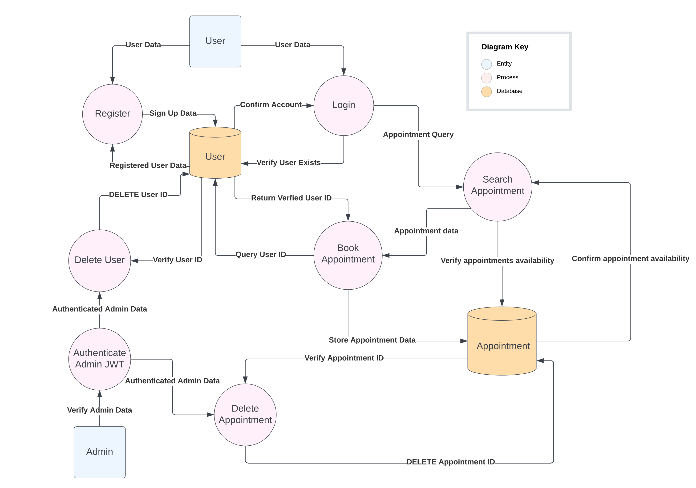
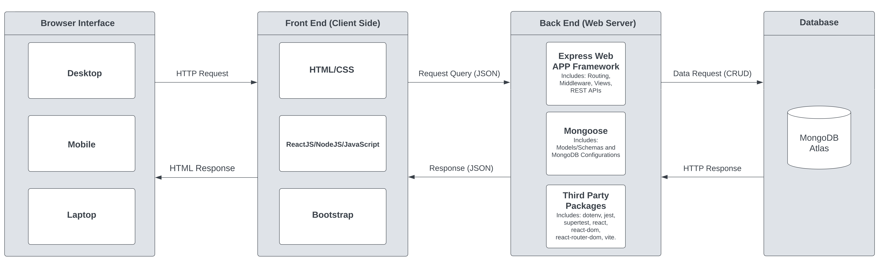
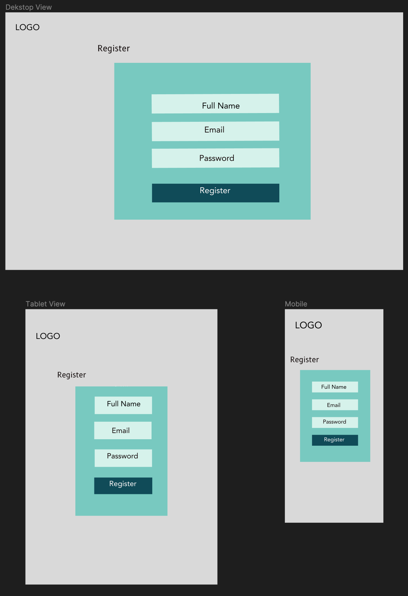
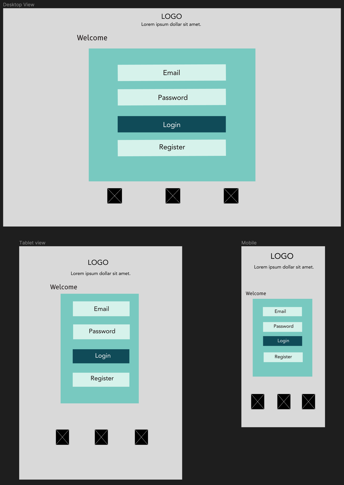
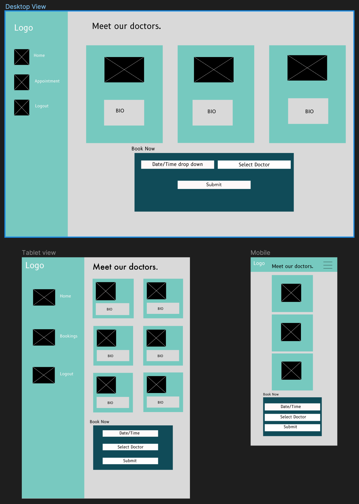
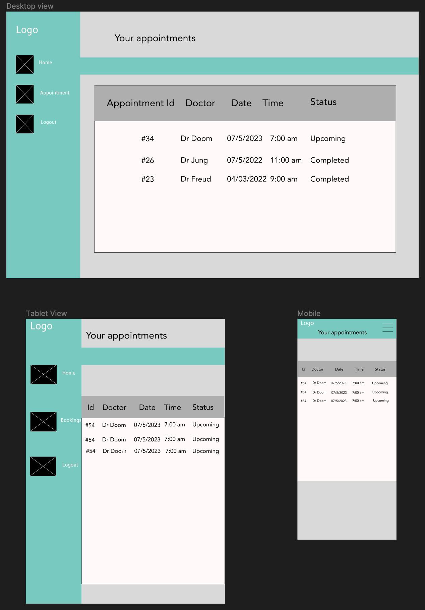
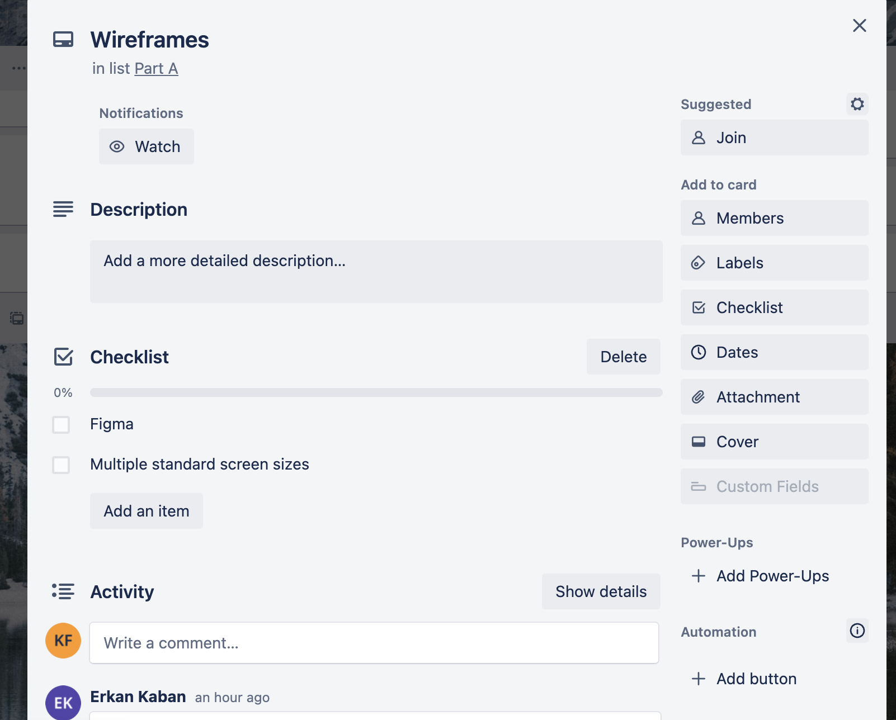
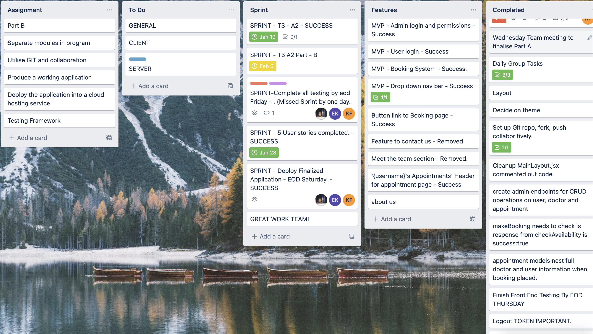
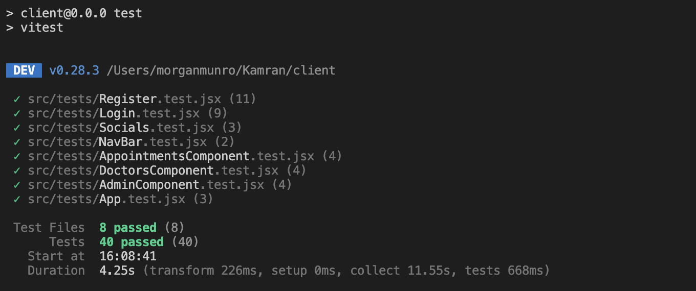
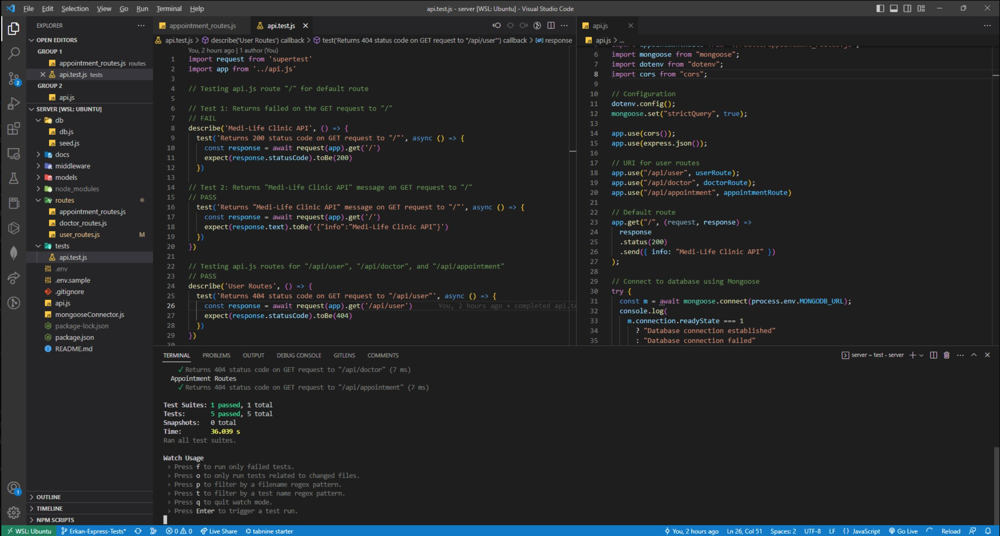

# T3A2-B - Full Stack App - Client

### Erkan Kaban (Student ID - 12980)
### Kamran Ozturk (Student ID - 13013)
### Adam Tunchay (Student ID - 13537)

### WDA2022-02

 

---
### [Deployed Application](https://silver-lebkuchen-3068d2.netlify.app/) ##

### [Github Repository - Client](https://github.com/Medi-Life-Clinic/client.git) ##

### [Github Repository - Server](https://github.com/Medi-Life-Clinic/server.git) ##

## <u>Purpose</u> 

Medi-life is a local doctor’s clinic that has approached our team of developers with a project to create an online booking platform for their patients. In the past, patients must call the clinic and book with the medical receptionist who entered the appointments into their scheduling software. The problem they face is the additional workload this booking system placed on their reception team, and they want to give the patients the ability to book their own appointments without needing to call the surgery during operating hours. 

## <u>Features</u> 

- Patients can register a new account to make a booking 

- Patients and the admin team can log in to the booking site with an existing account 

- Patients can select their preferred Doctor and book an appointment time 

- Appointment times are checked to see if there is an existing booking for that time 

- Patients can view their upcoming appointments 

- Patients can edit and delete their own appointments 

## <u>Possible Features</u> 

- Doctors are notified when a patient books an appointment with them 

- Doctors can accept or deny booking requests 

- User account can apply to become a doctor account pending admin’s approval 

## <u>Target Audience</u> 

This application is intended to ease the process of booking appointments at the clinic for both the patients of the clinic as well as the reception/administration team. 

## <u>Tech Stack</u> 

Front-end – React.js, HTML, CSS, Bootstrap, JavaScript 

Back-end – Express.js, Node.js 

Database – MongoDB, Mongoose 

Source Control – Git, GitHub 

Testing - Postman, Supertest, Jest-dom, Vitest 

Deployment – Heroku, Netlify

UI/Design – Figma, Lucid Charts 

Project-Management – Trello, Discord 
## <u>Dataflow Diagram</u>

## <u>Application Architecture Diagram</u>

  

## <u>User Stories</u>

**Patients**

- As a patient, I want to be able to register a new account, so that I can make a booking.
- As a patient, I want to be able to log in to the booking site with an existing account, so that I can make a booking.
- As a patient, I want to be able to select my preferred Doctor and see their availability, so that I can book an appointment time.
- As a patient, I want to be able to view my upcoming appointments, so that I can keep track of them.
- As a patient, I want to be able to update and delete my own appointments, so that I can change them if I need to.

**Admin**

- As an admin, I want to be able to see all the appointments that have been made, so I can manage the clinic’s schedule.
- As an admin, I want to be able to edit and delete any appointments that have been made, in case a doctor or patient's schedule changes.
- As an admin, I want to be able to delete user accounts, so that our database is clean of incorrect data or accounts that are no longer in use.
- As an admin, I want to be able to see all the users that have registered, so that I can manage the patient's accounts.

  

## <u>Initial drafts</u>

In the user stories featured above we felt this information easily conveyed our clients needs. Originally we had utilized a different format based off of our research, but came to the conclusion these were overly verbose, below we have attached some examples of our early drafts.

 

 
 

## <u>Wireframes</u>

### <u>Register</u>

### <u>Login</u>

### <u>Bookings</u>

### <u>Appointments</u>

## <u>Trello Board</u>
[Trello Link](https://trello.com/invite/b/tHb5bHeE/ATTI7749fd36a62d9a54caf4bc74f064c39a961E7D98/medical-application)

<h2>Week One Screenshots</h2>

- On day one of the project we decided to implement the Agile workflow process; the first step involved us organizing a meeting with our team to discuss and plan the project's creation. The second step involved visioning and targets on the tasks that needed completing as well as the due dates and features required for the project. After the discussion we decided upon using Trello for our project management software. 

- Each morning we hosted standups and planned out our tasks for the days as well as the sprints ahead, these were added as cards in their respective section. We added color coding for specific team members. This helped to signify visually what task were allotted to what member. 
  

  

  

  

- As you can see in these screenshot’s we added additional information within the cards as to avoid cluttering the board, on these checklist’s we went through and ticked off any task’s that were completed.
  

  

  

  

  

<h2>Week Two Screenshots</h2>

  

- Here you can see our progress throughout week two, we were meeting our sprints and development was for the most part succesful.

  

  
- Here you can see the Error Log we were working through. Each error to clear was assigned to certain team members.
  
<h2>Week Three Screenshots</h2>
 
  

- Here you can see our final Trello Board. All assigned tasks completed. We met all our Sprints except our testing Sprint by one day. We were still very happy with that outcome. 

  

- As you can see here all our errors were cleared by the assigned team members. 

   

## Testing Evidence

  

- Here you can see evidence of our final testing logs.

